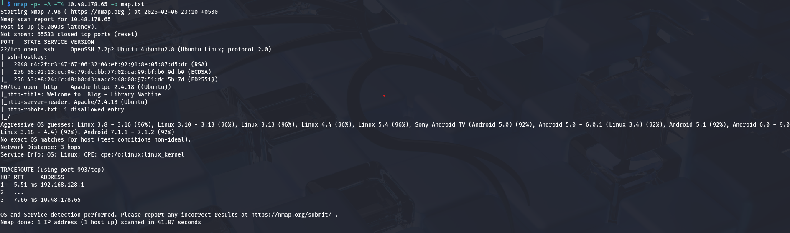
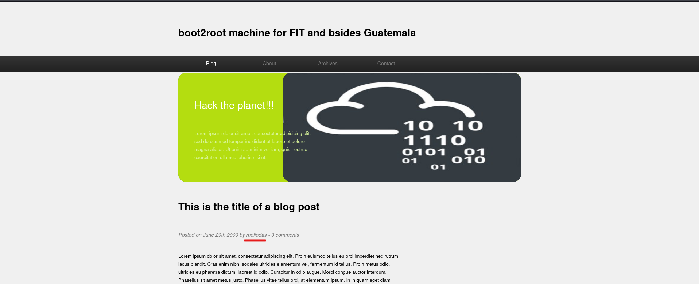
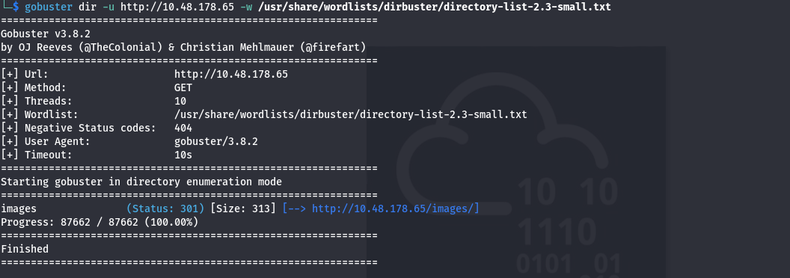
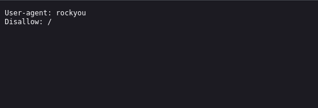
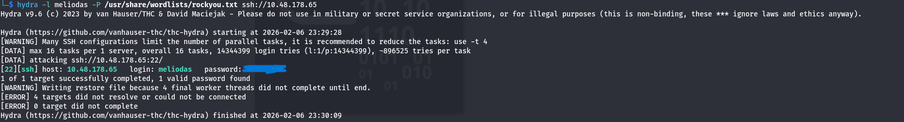
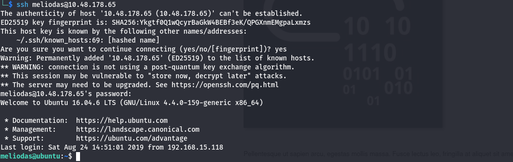
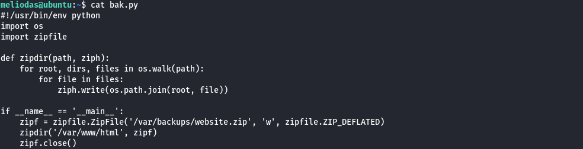
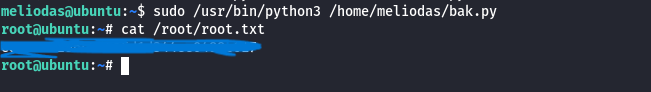

# Library CTF

Room: [https://tryhackme.com/room/bsidesgtlibrary](https://tryhackme.com/room/bsidesgtlibrary)

## Nmap 

We will first run nmap on our target ip machine to find which ports are open and what services they are running.

we can see that we have two ports open.

**port 22** which is running **ssh**.

**port 80** which is running **http**.

## Web Enumeration  

After we open the http file, we can find a username on the homepage. We will store that username to use it later.

### Gobuster

I tried running gobuster next but didn't find any directories we can exploit.

Most websites have a robots.txt file which tells web crawlers what page they have or don't have access to. We should always check to see if there is such a file since we are very interested in whatever files the owner is hiding from the crawlers.

After checking the robots.txt file,  i found a user-agent called rockyou. This clearly means we have to brute force the password using rockyou file.

### Hydra

As we have found a username and we know that the machine is running ssh, i decided to brute force the login using hydra.

and it worked. we found a password for the ssh.

## SSH

We use the ssh to login and gain access to the target machine.

### User.txt

In the home folder, we can find the flag for user.txt.

## Getting root

i ran sudo -l to see if we have any files we can execute as root or any other user and found a bak.py. 

I check bak.py and saw that it is importing a file called zipfile.

When a file is imported, python first check the current directory to see if it exits and if it does, it uses that file. Using this knowledge, we can create a zipfile.py which will spawn a shell.

*zipfile.py*

echo "import os; os.system('/bin/bash')"

### Root.txt

Now when we run bak.py, we will get a shell as root and we can get the flag root.txt.

