# U.A. High School CTF

Room: [https://tryhackme.com/room/yueiua](https://tryhackme.com/room/yueiua)

## Nmap 

We will first run nmap on our target ip machine to find which ports are open and what services they are running.

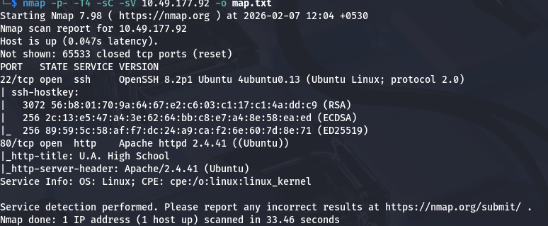

we can see that we have two ports open.

**port 22** which is running **ssh**.

**port 80** which is running **http**.

## Web Enumeration  

Opening the http file, we are greeted with a home page. I looked at the html code and search the cookies. There was nothing interesting.

### Gobuster

Since I couldn't find anything on the home pages, I decided to run gobuster.

We found a directory called /assets and when i open it, we are greeted with a blank page. I couldn't find anything here so i decided to do some common checks before enumerating even more here.

I checked for a cmd parameter and found out that we do have a cmd here and that it was returning us the output in base64 format.
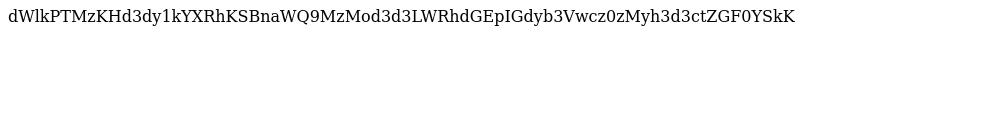

### Getting a Shell

I tried putting a fewcommon one line reverse shells in the argument but none of them worked. So to get the reverse shell, I created a http server on my machine and downloaded the shell code on the target machine. After Executing the shell code, I was able to successfully get a reverse shell.

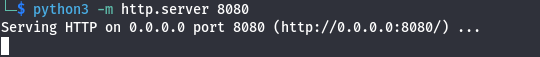

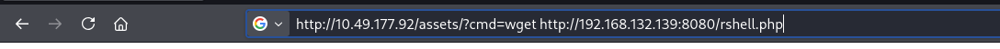

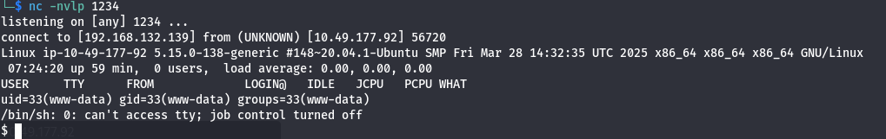

### Enumeration

I found a file called passphrase.txt which containted base64 string. I decoded the string and got a password. 

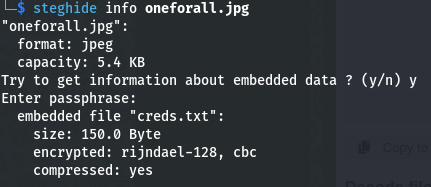

I first thought that i could use this to gain access as deku who is the user by either ssh or su but that didn't work. So i kept enumerating.

I found two images which i downloaded on my machine thinking as the file was called passphrase, maybe we have to use steghide.

### Steghide

when i run steghide on oneforall.jpg, it gave me an error saying that the file format is not supported. Checking the magicbytes using hexeditor, we can see the magic bytes is for png.

So we have to replace the magic bytes to jpg.

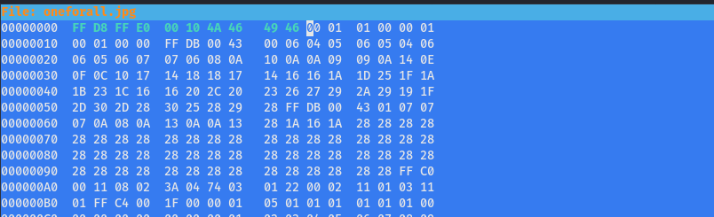

Once we have done that, we can extract the data embedded in the image using steghide. We found a creds.txt which contained  the password for deku.

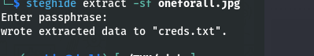

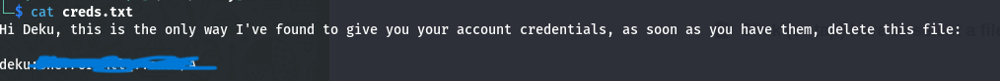

### User.txt

Now we can switch to deku and read the user.txt flag.

## Getting root

Running sudo -l, we can find a file called feedback.sh.

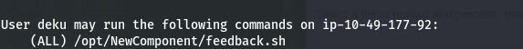

Let's read the content of feedback.sh

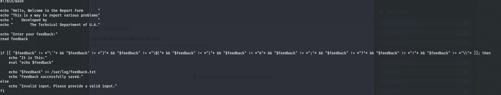

We can see the code is doing **eval "Echo $feedback"** which we can exploit to run our own scripts.

We will write **deku ALL=NOPASSWD: ALL >> /etc/sudoers** as feedback to add deku as a sudoer who can run everything as root with no password.

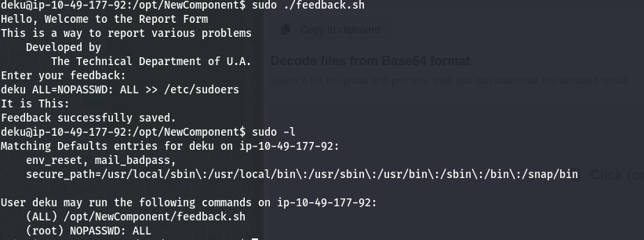

### root.txt

Now we can read the root.txt by getting bash as root.

