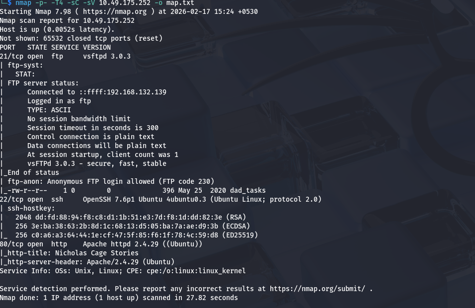
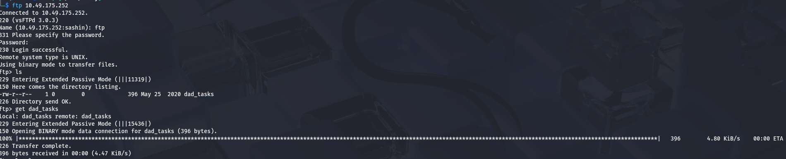
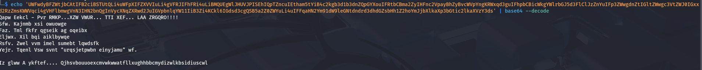
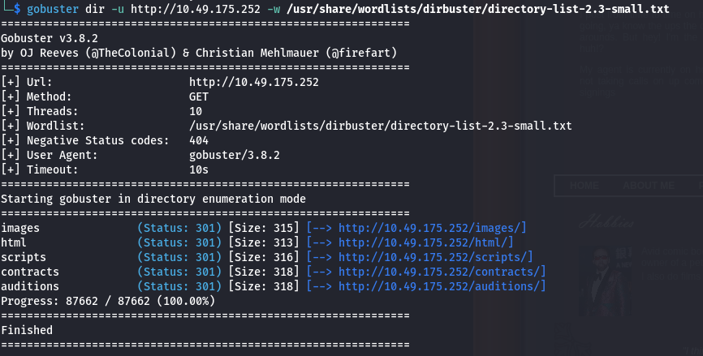
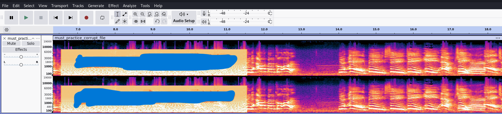
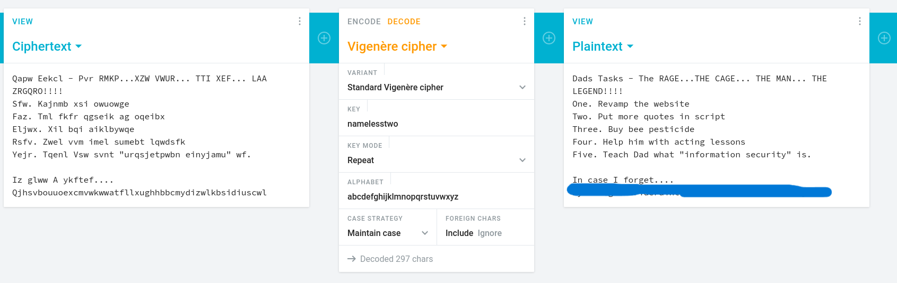
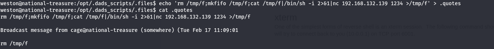
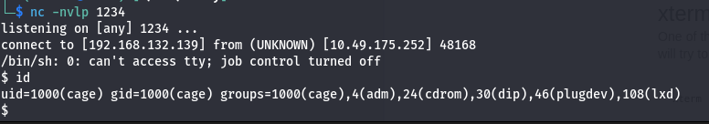
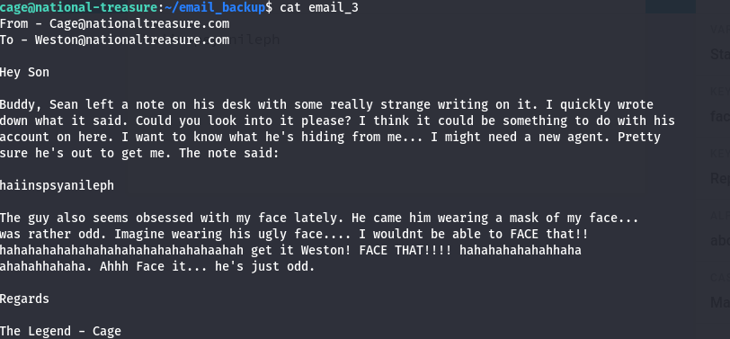
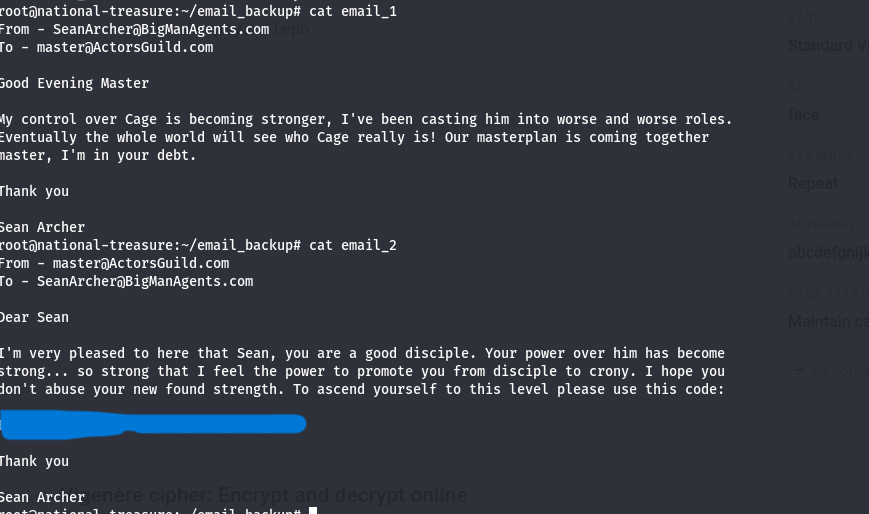

# Break Out The Cage

Room: [https://tryhackme.com/room/breakoutthecage1](https://tryhackme.com/room/breakoutthecage1)

## Nmap 

We will first run nmap on our target ip machine to find which ports are open and what services they are running.

we can see that we have three ports open.

**port 21** which is running **FTP**.

**port 22** which is running **ssh**.

**port 80** which is running **http**.

## FTP 

Connecting to the FTP port, we find a file called dad_tasks which we will get on our machine.

Reading the content of the dad_task file, we find an base64 encoded string. Decoding the string gives us an encrypted text.

After checking for the type of encryption, i found out that it is vigenere-cipher and we need a key to decode it. Since we don't have the key right now, we can keep enumerating.

## HTTP

Running gobuster on the target reveals some directories we can explore.

We find an corrupted mp3 file in the auditions directory which could mean that someone tampered with it. We will download the file to analyze it.

Opening the audio on audacity and applying spectogram, we find an text embedded in the corrupted part.

This might be the key of the encryption. Using this key, we can finally decode the encrypted text. We found the password for weston.

## SSH

We can use the password we found to ssh login as Weston.

After enumerating the machine for a while, we find a file called spread_the_quotes.py which is running periodically to broadcast quotes. Reading its content, we can see that it is running os.system("Wall " + quote). We can inject our own command here by replacing the .quotes file with a shell payload.

We can get ssh login using the private key.

## user flag

We can find the user flag in the Super_Duper_Checklist file.

In email_3, we find a vigenere encrypted text with the key face. Decrypting the text gives us the password for root.

## Root

We can find the root flag in email_2.

