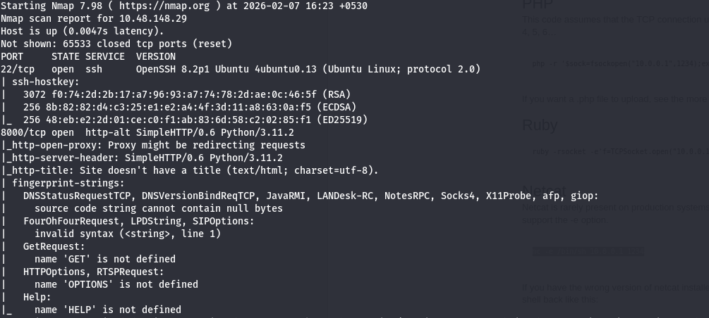
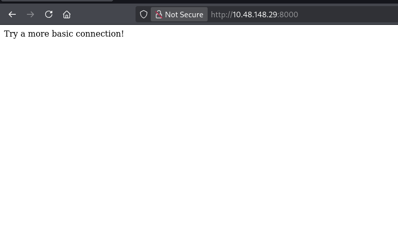
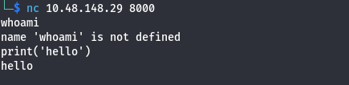
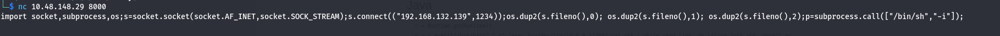
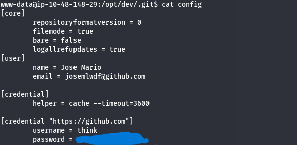
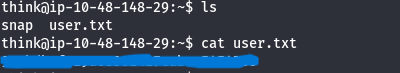
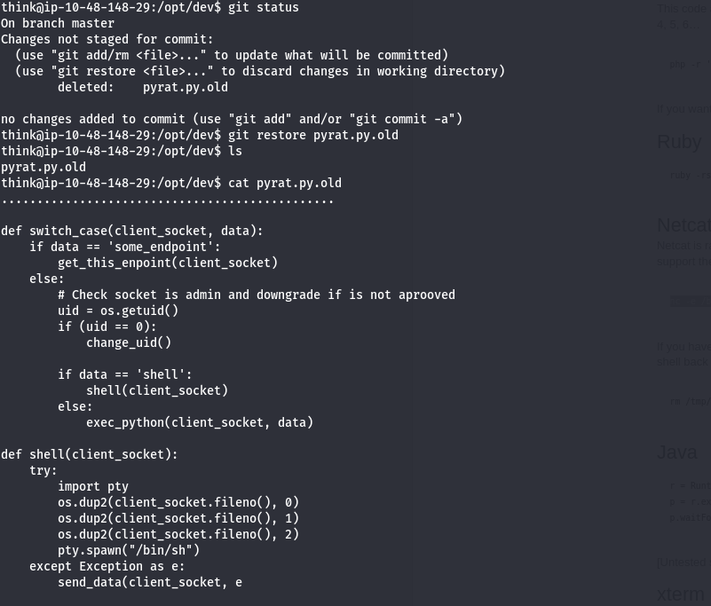
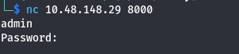
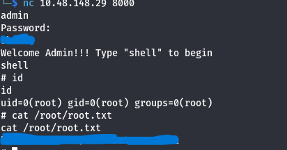

# Pyrat CTF

Room: [https://tryhackme.com/room/pyrat](https://tryhackme.com/room/pyrat)

## Nmap 

We will first run nmap on our target ip machine to find which ports are open and what services they are running.

we can see that we have two ports open.

**port 22** which is running **ssh**.

**port 8000** which is running **http-alt**.

## Enumeration  

Opening the port 8000 http file, we get a text saying 'Try a more basic connection'. So we can try using netcat.

### netcat

Using netcat, we get a successful connection. We know that this port is running python and we can check that by running some python commands.

### Getting a reverse shell

We will use the python one liner from pentestmonkey to get a reverse shell.

### Getting user access

Searching for a bit, we can find a dev directory inside /opt which contains a .git directory. Inside the .git directory, there is a file called config. Reading the config file, we find a username 'think' and a password.

We can now change user to think.

### user.txt

We can find user.txt in /home/think directory

## Getting root

Since we know there is a git repo, we can use git status to check for any modified files. We find there is a deleted file called pyrat.py.old. Let's read the content of the file.

So what this code does is establist a nc connection with a special endpoint.

I asked chatgpt for some common endpoint and after fuzzing them, i found admin was one of them.

Now we need a password. We can brute force the password by writing a python script.

### root.txt

Now, we can read the root.txt file

